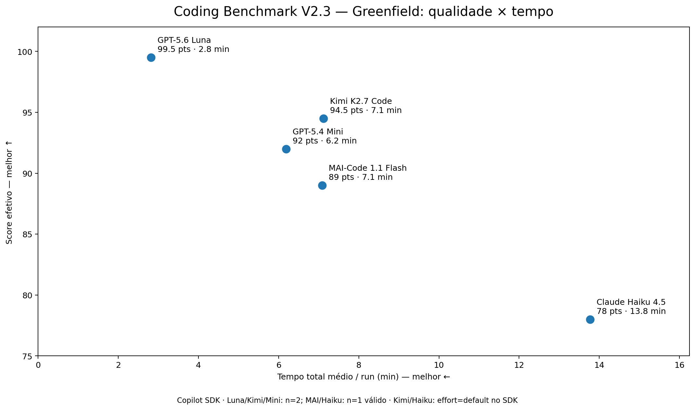
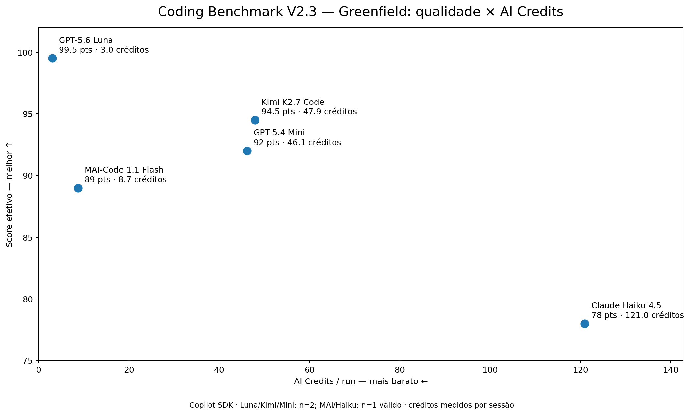

# JS/TS LLM Coding Benchmark Runner

Benchmark local para comparar modelos/agentes de código em tarefas JavaScript/TypeScript.

Projeto pessoal e experimental. A ideia é medir agentes em tarefas reais de coding, mantendo o mesmo prompt, o mesmo artefato de avaliação e uma trilha de auditoria por execução. Os resultados não são uma classificação universal dos modelos: representam estas configurações, este harness e estas campanhas.

## Resultados compartilhados — 12 de agosto de 2026

Texto preparado para compartilhar os resultados da campanha greenfield pelo Copilot SDK. Foram usados dois rounds por modelo, com créditos medidos por sessão. O `effectiveScore` inclui resultados recuperados por reavaliação local quando o artefato permaneceu inalterado; o score original continua preservado no relatório.

| Modelo | Score greenfield | Tempo/run | AI credits/run |
|---|---:|---:|---:|
| GPT-5.6 Luna | 99,5 | 2,8 min | 3,02 |
| Kimi K2.7 Code | 94,5 | 7,1 min | 47,91 |
| GPT-5.4 Mini | 92,0 | 6,2 min | 46,14 |
| MAI-Code 1.1 Flash | 89,0 | 7,1 min | 8,72 |
| Claude Haiku 4.5 | 78,0 | 13,8 min | 120,99 |

Nesta amostra, o GPT-5.6 Luna apresentou o melhor equilíbrio entre qualidade, tempo e consumo. O Kimi atingiu um teto alto, mas com consumo maior; o GPT-5.4 Mini ficou competitivo; o MAI foi econômico; e o Haiku ficou atrás nos três eixos. No bugfix, o Luna marcou 100/100 nos dois rounds da campanha correspondente.

Essa é uma amostra pequena e não deve ser tratada como benchmark universal. OpenCode, Codex e Copilot SDK medem `modelo + harness`; aliases podem apontar para revisões diferentes; e scores reavaliados são identificados separadamente no relatório.

### Gráficos





## Instalação

```bash
npm install
```

Requisitos do host:

- Node.js 20+;
- npm;
- OpenCode e/ou Codex CLI conforme os modelos habilitados;
- Google Chrome/Chromium no `PATH` para score final de greenfield com E2E de UI.

O runner usa `playwright-core` com o Chrome/Chromium do sistema; não baixa um navegador próprio.

## Configuração

Edite `config/models.json` para habilitar/desabilitar modelos e `config/benchmark.json` para ajustar rounds, timeout, validações, captura visual e embaralhamento da campanha.

A rubrica atual é **2.3**.

## Harness Copilot SDK

A V2.3 mantém OpenCode e Codex disponíveis, mas deixa ativos por padrão os cinco modelos configurados no harness `copilot-sdk`: GPT-5.6 Luna, GPT-5.4 mini, Kimi K2.7 Code, MAI-Code-1.1-Flash e Claude Haiku 4.5. Cada execução usa uma sessão e um diretório Copilot isolados.

Para instalar e fazer um smoke test sem consumir créditos:

```bash
npm install
npm run bench -- --engine copilot --dry-run --concurrency 2
```

Para executar a campanha real, removendo `--dry-run`, o SDK coleta tokens e AI credits por sessão via `session.rpc.usage.getMetrics()`. O benchmark não executa agentes durante `npm test`, `npm run typecheck` ou dry-run.

## Como rodar

```bash
# Todos os benchmarks/modelos habilitados
npm run bench

# Apenas um benchmark
npm run bench:greenfield
npm run bench:bugfix

# Filtrar engine/modelo
npm run bench -- --engine opencode --model opencode-go/deepseek-v4-flash
npm run bench -- --engine codex --model gpt-5.6-luna

# Ordem aleatória, porém reproduzível
npm run bench -- --seed 20260811

# Ver plano sem gastar créditos
npm run bench -- --dry-run --seed 20260811

# Rodar com no máximo dois agentes simultâneos
npm run bench -- --concurrency 2

# Relatório
npm run report
```

## Rubrica 2.3

A nota final é dominada por comportamento verificável. O score heurístico antigo continua no relatório apenas como diagnóstico.

### Greenfield — 100 pontos

| Componente | Pontos |
|---|---:|
| Hidden functional evaluator pós-agente | 35 |
| E2E funcional de UI via Playwright | 15 |
| Typecheck direto | 15 |
| Testes visíveis executados pelo runner real | 10 |
| Build direto | 10 |
| Lint | 5 |
| Arquitetura | 5 |
| README/setup | 5 |

### Bugfix — 100 pontos

| Componente | Pontos |
|---|---:|
| Hidden functional evaluator pós-agente | 35 |
| Preservação de testes/scripts do fixture | 15 |
| Typecheck direto | 15 |
| Testes visíveis executados pelo runner real | 10 |
| Build direto | 10 |
| Lint | 5 |
| Arquitetura | 5 |
| README/setup | 5 |

Hard gates:

- hidden functional `< 25/35` limita a nota a 69;
- typecheck ou build falhando limita a nota a 79;
- greenfield com E2E executado e falhando não pode passar de 89;
- se o host não tiver ambiente Playwright/Chrome disponível, greenfield recebe `scoreStatus=ui_unverified` e **não recebe score final comparável**;
- erro de harness/provider/timeout recebe `score=null` e é contado separadamente de falha do modelo.

## Hidden functional evaluator independente

O evaluator não usa Vitest/Jest do projeto candidato. Ele é injetado somente **depois** que o coding agent termina e é executado com o runtime TypeScript do próprio benchmark.

Isso permite ao candidato escolher Vitest ou Jest sem alterar os 35 pontos funcionais e impede gaming por scripts como `"test": "true"`.

O evaluator usa SQLite/Prisma real e verifica:

- Zod para o shape completo;
- create/list;
- busca case-insensitive por título;
- busca case-insensitive por autor;
- update/delete;
- importação JSON válida e persistida;
- rejeição de JSON malformado/dados inválidos.

## Testes visíveis sem confiar em `npm test`

Os 10 pontos de testes visíveis também não confiam no script `npm test` escrito pelo agente. O runner procura e executa diretamente:

- `vitest run`; ou
- `jest --runInBand`.

No bugfix, os testes continuam protegidos pelo Git baseline e não podem ser alterados sem penalidade.

## Contrato funcional do greenfield

Para permitir testes externos iguais entre modelos, o prompt exige:

- `src/lib/db.ts`: `prisma`;
- `src/lib/schema.ts`: `bookSchema`, `importSchema`;
- `src/lib/books.ts`: `listBooks`, `searchBooks`, `createBook`, `updateBook`, `deleteBook`;
- `src/lib/import.ts`: `importBooksFromJson`.

## E2E funcional de UI

O prompt greenfield inclui hooks `data-testid` mínimos para tornar o E2E determinístico. O Playwright opera a **interface real** e verifica:

1. carregamento sem runtime error;
2. cadastro de livro;
3. busca case-insensitive;
4. edição de status/rating com persistência após reload;
5. importação de JSON via input de arquivo;
6. exclusão persistida após reload.

O evaluator gera `ui-functional.json` e `e2e-final.png` por execução.

O smoke visual separado continua gerando screenshot para revisão humana, mas não dá pontos de estética.

## Bugfix: baseline e proteção contra gaming

Antes do agente começar, o runner cria um commit Git baseline. Depois são detectados:

- testes removidos/modificados;
- scripts `typecheck/test/build/lint` modificados;
- Prisma removido;
- rewrite excessivo do `src/`;
- `any`, `@ts-ignore`, `@ts-expect-error`, `eslint-disable`;
- importação ainda silenciando erro.

O fixture não contém comentários `BUG 1`, `BUG 2` etc. e o teste de busca cria seu próprio `Dune`, sem seed implícita.

## Proveniência do modelo

### V2.3: harness Copilot SDK e créditos reais

A V2.3 mantém o `artifactScore` separado do score oficial e adiciona o harness `copilot-sdk`. Em timeout, erro de evaluator ou falha de harness, o artefato continua auditável, mas a execução não entra como score comparável. O relatório registra tokens, cache e, nas sessões do Copilot SDK, AI credits e premium request cost. Consulte `CHANGELOG_BENCHMARK_V2_3.md`.

Cada execução salva `model-runtime.json` com:

- `requestedModel`;
- `resolvedModel`, quando observável no output do provider;
- `modelRevision`/checkpoint, quando exposto;
- `systemFingerprint`, quando exposto;
- evidência de onde a metadata foi encontrada.

Se o provider não expõe revisão/fingerprint, o valor fica explicitamente `null/unknown`; o benchmark **não inventa** um checkpoint. Isso é importante para aliases como `deepseek-v4-flash` que podem mudar por trás do mesmo nome.

## Ambiente e stack gerada

Antes da campanha, o runner faz preflight e salva `results/environment.json`:

- Node/npm;
- SO/arquitetura;
- CPU/quantidade de CPUs;
- RAM.

Node abaixo do requisito configurado interrompe a campanha.

Cada run também gera `project-metadata.json` com dependências, lockfile e hashes do `package.json`/lockfile para permitir análise posterior de diferenças de stack.

## Estatística e eficiência

O relatório inclui por configuração:

- média;
- mediana;
- mínimo/máximo/range;
- P25/P75/IQR;
- desvio padrão;
- coeficiente de variação;
- taxa de sucesso;
- falhas de harness;
- UI não verificável;
- falhas funcionais;
- falhas catastróficas do modelo (`score < 70`);
- tempo médio;
- custo médio;
- score/minuto;
- score/US$.

Também são calculadas fronteiras de Pareto de:

- qualidade × tempo;
- qualidade × custo.

## Timeout e processos

O runner registra explicitamente `timedOut`, `signal` e `harnessErrorType=agent_timeout`.

Em Linux/macOS, processos são iniciados em process groups e o timeout tenta encerrar a árvore inteira.

## Campanhas reproduzíveis

`shuffleRuns=true` embaralha benchmark/modelo/round para reduzir viés de ordem/cache/throttling. A seed e o plano ficam em `results/campaign.json`.

Use `--seed <n>` para repetir exatamente a ordem.

## Arquivos por execução

Cada run gera, entre outros:

- `project/`;
- `raw.log`;
- `meta.json`;
- `model-runtime.json`;
- `project-metadata.json`;
- `validation.log`;
- `ui-functional.json`;
- `score.json`;
- `usage.json`;
- `visual.json`;
- `manual-review.md`.

A campanha também gera `results/environment.json` e `results/campaign.json`.

O consolidado fica em `reports/report.md` e `reports/report.json`.

## Limitações

- O contrato mínimo reduz liberdade arquitetural em troca de comparabilidade objetiva.
- O E2E de UI exige Chrome/Chromium disponível no host.
- Metadata de checkpoint depende do que cada provider/harness expõe.
- Modelos continuam não determinísticos; use múltiplos rounds.
- OpenCode × Codex mede `modelo + harness`, não apenas o modelo.
- Container por execução ainda não é obrigatório; ambiente do host é capturado para auditoria, mas isolamento total de SO permanece uma evolução futura.
